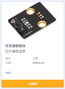
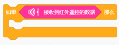
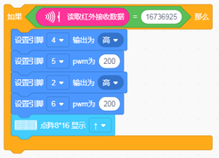
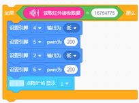
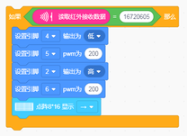
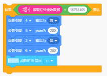
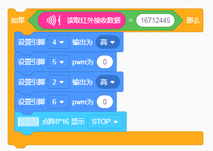
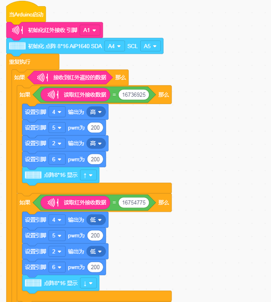
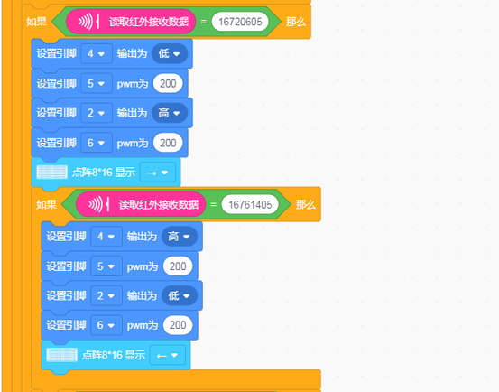
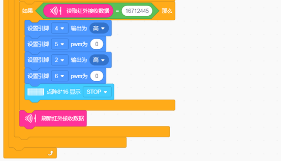

# 第14课 红外遥控智能车

## （1）项目介绍：

前面的学习中我们详细的介绍了智能车上各个传感器、模块、扩展板的使用方法。在这里我们可以再结合前面课程中知识制作一个红外控制智能车。在传感器项目第四课中，我们已经测试出红外遥控器各个按键对应的键值。实验中，我们可以通过代码设置（键值），让对应的按键控制智能车对应的运动状态，且相应的状态模式显示在8X16 LED矩阵上。

## （2）流程图：

循迹智能车具体逻辑如下表格：

|按键：|键值：16736925|状态：前进|
|-|-|-|
|按键：|键值：16754775|状态：后退|
|按键：|键值：16720605|状态：左转|
|按键：|键值：16761405|状态：右转|
|按键：|键值：16712445|状态：停止|

按照前面思路设计好智能车后，我们就需要按照设计思路开始制作智能车。我们需要设计对应的接线，测试代码，然后接线上传代码，运行，确保智能车能够实现理想中的功能。

## （3）接线图：电机+红外接收模块

接线注意：由于红外接收传感器输入的数字信号，将红外接收传感器模块用导线连接到电机驱动扩展板上的G、V、A1
; A、B两组电机分别对应的连接到堆叠在UNO Plus板上的电机驱动扩展板上的接口A和接口B，电源接到BAT接口。

## （4）测试代码：

添加红外传感器

在事件栏拖出Arduino启动模块

在红外栏拖出舒适化红外接收模块，设置引脚为A1

初始化点阵

在控制栏拖出重复执行模块

在控制栏拖出判断模块，判断是否有接收到红外遥控的数据

在控制栏拖出判断模块，并判断“读取红外数据”是否等于“16736925”如果是则执行小车前进代码，点阵显示前进箭头

在控制栏拖出判断模块，并判断“读取红外数据”是否等于“16754775”如果是则执行小车后退代码，点阵显示后退箭头

在控制栏拖出判断模块，并判断“读取红外数据”是否等于“16720605”如果是则执行小车左转代码，点阵显示左转箭头（由于左右箭头的代码块是按照点阵面向自己的方向做的，所以左右箭头在指示小车状态的时候刚好相反）

在控制栏拖出判断模块，并判断“读取红外数据”是否等于“16761405”如果是则执行小车右转代码，点阵显示右转箭头（由于左右箭头的代码块是按照点阵面向自己的方向做的，所以左右箭头在指示小车状态的时候刚好相反）

在控制栏拖出判断模块，并判断“读取红外数据”是否等于“16712445”如果是则执行小车停止代码，点阵显示“STOP”

在红外栏拖出刷新红外接收数据

（注意：在上传测试代码前，需要把蓝牙模块取下，否则测试代码会上传失败。需要上传代码成功后，再连接蓝牙模块。）

## （5）测试结果：

将驱动扩展板堆叠在UNO Plus板上，上传好代码，按照接线图接线，将拨码开关拨至ON端后，我们就能用红外遥控控制智能车运动了。

