# 第16课 蓝牙调速智能车

## （1）项目介绍：

前面课程中，我们利用蓝牙控制智能车，在这课程中我们做一个蓝牙可以控制速度的智能车。既然要控制智能车速度，我们可以将速度定义一个变量speeds来表示。项目中我们只要改变这是变量speeds就可以改变智能车的速度啦。下面让我们通过代码来实现。

## （2）流程图：

按照前面思路设计好智能车后，我们就需要按照设计思路开始制作智能车。我们需要设计对应的接线，测试代码，然后接线上传代码，运行，确保智能车能够实现理想中的功能。

## （3）接线图：蓝牙+电机

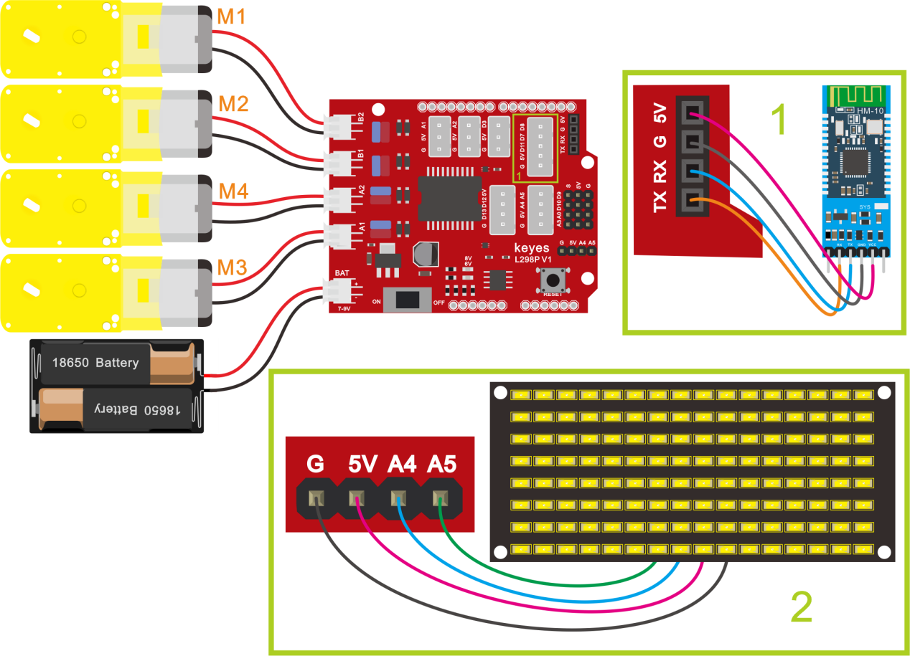

接线跟上一课一样

## （4）测试代码：

在事件栏拖出Arduino启动模块

在串口栏拖出设置串口波特率为9600

在变量类型栏拖出声明全局变量，整形，变量名为bluetooth_val，赋值0

在变量类型栏拖出声明全局变量，整形，变量名为speeds，赋值150

初始化点阵

在控制栏拖出重复执行模块

在控制栏拖出判断模块，判断可读取字节数大于0

将串口读取数字赋给bluetooth_val

在控制栏拖出判断语句，判断“Bluetooth_val”是否等于“70”如果是则执行前进代码(PWM值使用变量“speeds”代替)，点阵显示前进箭头

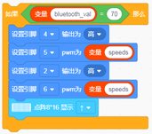

在控制栏拖出判断语句，判断“Bluetooth_val”是否等于“66”如果是则执行后退代码(PWM值使用变量“speeds”代替)，点阵显示后退箭头

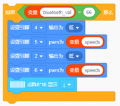

在控制栏拖出判断语句，判断“Bluetooth_val”是否等于“76”如果是则执行左转代码(PWM值使用变量“speeds”代替)，点阵显示左转箭头

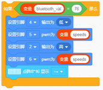

在控制栏拖出判断语句，判断“Bluetooth_val”是否等于“82”如果是则执行右转代码(PWM值使用变量“speeds”代替)，点阵显示右转箭头

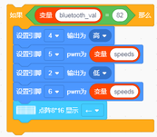

在控制栏拖出判断语句，判断“Bluetooth_val”是否等于“97”如果是则执行加速代码，点阵显示笑脸“^\_^”

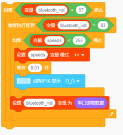

在控制栏拖出判断语句，判断“Bluetooth_val”是否等于“100”如果是则执行减速代码，点阵显示苦脸“\>\_\<”

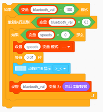

在控制栏拖出判断语句，判断“Bluetooth_val”是否等于“83”如果是则执行停止代码，点阵显示”STOP”

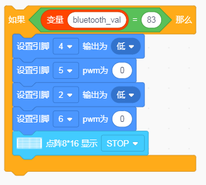

完整代码：（注意上传代码的时候必须拔下蓝牙模块不然会上传不成功的，上传完在装回去）

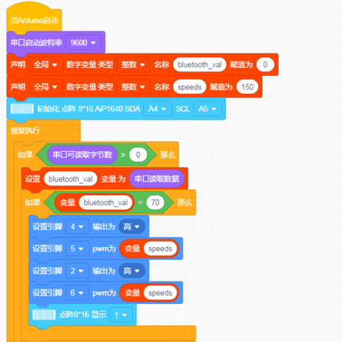

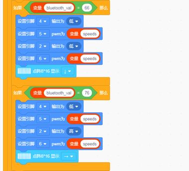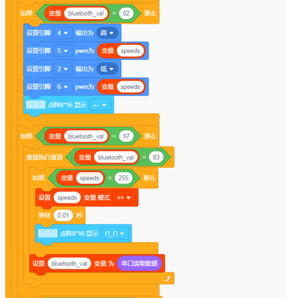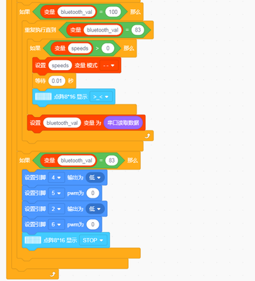

## （4）测试结果：

按下按钮，小车加速；按下按钮，小车减速.

