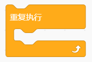
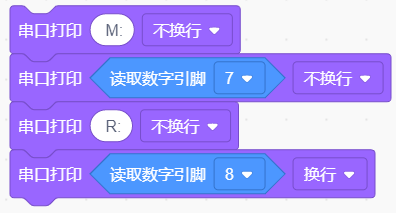
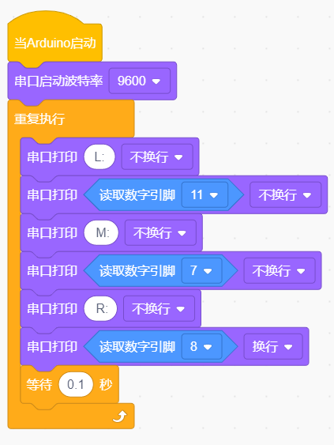
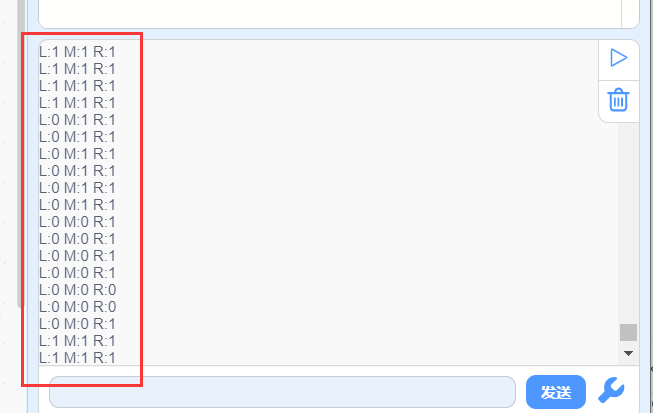
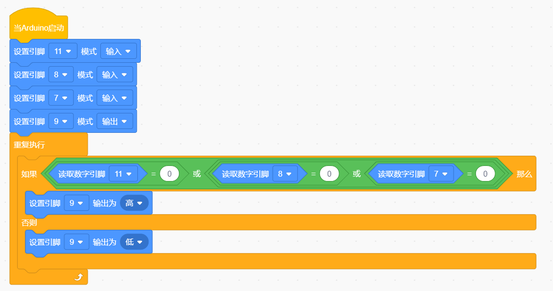

# 第3课 巡线传感器

## （1）项目介绍：

循迹传感器实际上是红外传感器。 此处使用的组件是TCRT5000红外管。

其工作原理是利用红外光对颜色的不同反射率，然后将反射信号的强度转换为电流信号。

在检测过程中，黑色在高电平时处于活动状态，而白色在低电平时处于活动状态。
检测高度为0-3厘米。

KEYES三路循迹模块在一块板上集成了三个TCRT5000红外管，接线和控制更加方便。

通过旋转传感器上的可调电位器，可以调节传感器的检测灵敏度。

## （2）参数：

工作电压：3.3-5V（DC）

接口：5PIN

输出信号：数字信号

检测高度：0-3厘米

特别说明：在测试之前，请旋转传感器上的电位器以调整检测灵敏度。
当将LED调整在ON和OFF之间的阈值时，灵敏度是最好的。

## （3）项目组件：

|Keyes Uno Plus 开发板 红色环保*1|Keyes brick L298P 电机驱动扩展板V1*1|keyes 草帽LED白发红模块*1|Keyes connectors循迹传感器*1|
|-|-|-|-|
|||||
|XH2.54转PH2.0 5P 连接线*1|3Pin 双母头杜邦线*1|USB线*1|18650双节电池盒*1|18650电池*2 （电池自配）|
|||||

## （4）接线图:

循迹传感器接扩展板的D11、D7、D8引脚（左11，中7，右8）。

## （5）项目代码：

在事件栏拖出Arduino启动模块

在串口栏拖出设置串口波特率模块，波特率为9600

在控制栏拖出重复执行模块

在串口栏拖出串口打印模块，设置打印文字“L：”不换行

在串口栏拖出串口打印模块，添加串口模块中的读取数字引脚模快引脚为11脚，不换行

在以上面步骤同样的方法添加“M：”“R：”引脚为7，8

在控制栏拖出延时模块并设置延时为0.1秒

完整代码：

## （6）项目结果：

上传代码带开发板，打开串口监视，可以看到左中右三个循迹传感器的状态，如果我们用白纸去遮挡传感器，传感器的状态都是0。在没有接收到信号的时候，三个传感器都是高电平状态，显示的数值是1。

## （7）项目拓展：

上面我们了解了循迹传感器的工作原理，接下来我们在第9脚接上一个LED
灯，然后通过读取循迹传感器的状态，来控制LED的亮和灭。如下图接线：

我们开始来编写代码：

上传代码到开发板，用我们的手去一个个的靠近传感器，我们看看LED灯的状态发生了改变没有？当我们用手去遮挡循迹传感器的时候，我们可以看到LED灯亮起来了。

