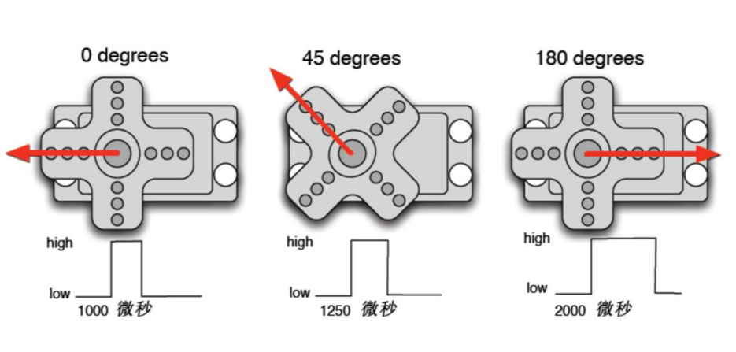
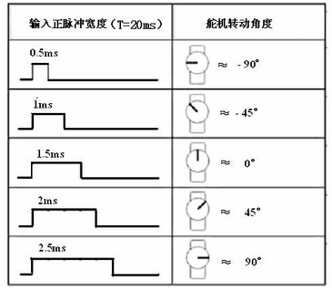
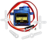
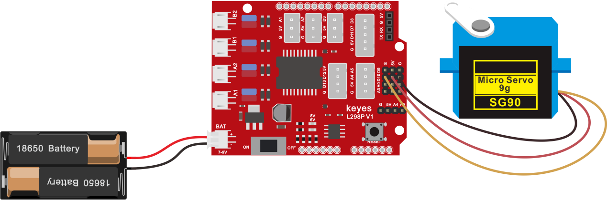
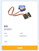
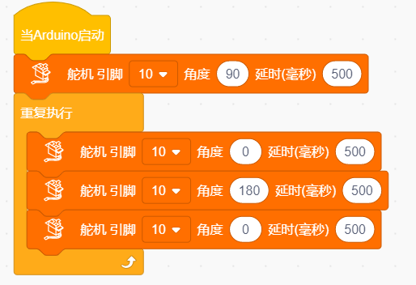

# 第4课 舵机控制

## （1）项目介绍：

舵机是一种位置伺服的驱动器，主要是由外壳、电路板、无核心马达、齿轮与位置检测器所构成。其工作原理是由接收机或者单片机发出信号给舵机，其内部有一个基准电路，产生周期为20ms，宽度为1.5ms
的基准信号，将获得的直流偏置电压与电位器的电压比较，获得电压差输出。

舵机有很多规格，但所有的舵机都有外接三根线，分别用棕、红、橙三种颜色进行区分，由于舵机品牌不同，颜色也会有所差异，棕色为接地线，红色为电源正极线，橙色为信号线。

舵机的转动的角度是通过调节PWM（脉冲宽度调制）信号的占空比来实现的，标准PWM（脉冲宽度调制）信号的周期固定为20ms（50Hz），理论上脉宽分布应在1ms到2ms
之间，但是，事实上脉宽可由0.5ms 到2.5ms
之间，脉宽和舵机的转角0°～180°相对应。

对应的舵机角度值如下:

## （2）舵机参数：

工作电压：DC 4.8V〜6V

可操作角度范围：大约 About 180°(在 500→2500 μsec)

脉波宽度范围：500→2500 μsec

空载转速：0.12±0.01 sec/60（DC 4.8V） 0.1±0.01 sec/60（DC 6V）

空载电流：200±20mA（DC 4.8V） 220±20mA（DC 6V）

停止扭力：1.3±0.01kg·cm（DC 4.8V） 1.5±0.1kg·cm（DC 6V）

停止电流：≦850mA（DC 4.8V） ≦1000mA（DC 6V）

待机电流：3±1mA（DC 4.8V） 4±1mA（DC 6V）

## （3）项目组件：

|keyes PLUS 开发板*1|Keyes brick L298P 电机驱动扩展板 V1*1|keyes SG90 9G舵机*1|
|-|-|-|
||||
|USB线*1|18650双节电池盒*1|18650电池*2 （电池自配）|
|||

## （4）接线图：

接线注意：舵机连接到G（GND）、V（VCC）、10，舵机的棕色线是与Gnd(G)相连，红色线与5v(V)相连，橙色线是与数字10相连的。接舵机的时候必须要外接供电，因为驱动舵机的电流要求比较大，一般峰值的情况下接近1A，开发板的电流远远不够。如果不接外接电源，很有可能烧坏开发板。

## （5）项目代码

添加舵机代码块

在事件栏拖出Arduino启动模块

初始化舵机：在舵机栏拖出设置舵机模块，引脚为10，角度为90延时为500

在控制栏拖出重复执行模块

在舵机栏拖出设置舵机模块，引脚为10，角度为0延时为500

在舵机栏拖出设置舵机模块，引脚为10，角度为180延时为500

在舵机栏拖出设置舵机模块，引脚为10，角度为0延时为500

\*\*\*\*\*\*\*\*\*\*\*\*\*\*\*\*\*\*\*\*\*\*\*\*\*\*\*\*\*\*\*\*完整的代码如下\*\*\*\*\*\*\*\*\*\*\*\*\*\*\*\*\*\*\*\*\*\*\*\*\*\*\*\*\*\*\*\*

在上传代码成功，我们可以看到舵机在0°到180°角度范围来回摆动。

