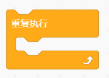
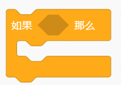
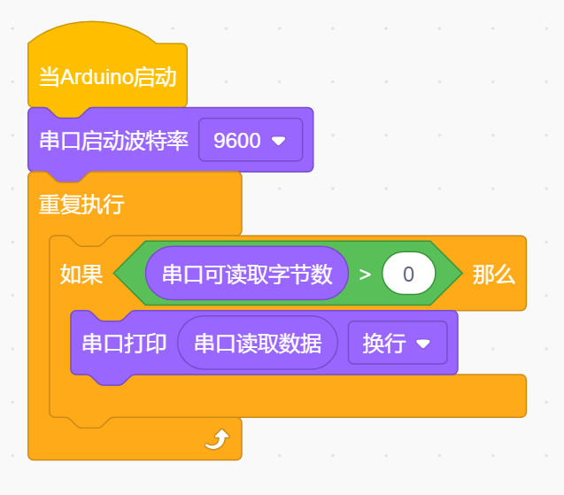
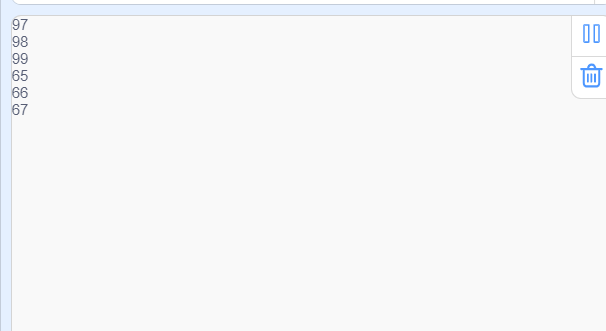
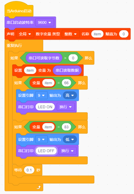

# 第7课 蓝牙控制

## （1）项目介绍：

蓝牙是近几十年来最流行的一种简单的无线通信模块，易于使用，已在大多数电池供电的设备中使用。蓝牙标准进行了许多升级，以不断满足客户和技术的需求。几年来，发生了许多变化，包括数据传输速率，可穿戴设备和IoT设备以及安全系统的功耗。

在这里，我们将学习DX-BT24。 DX-BT24是一种随时可用的蓝牙模块。
该模块用于建立无线数据通信。

## （2）蓝牙参数：

蓝牙协议：Bluetooth Specification V5.1 BLE

工作距离：在开放环境中，实现50-100m超远距离通讯

工作频率：2.4GHz ISM频段

通信接口：UART

蓝牙认证：符合FCC CE ROHS REACH认证标准

FLASH：1M

串口参数：9600、8数据位、1停止位、无效位、无流控

电源：5V DC

工作温度：–5至+65摄氏度

## （3）项目组件：

|keyes PLUS 开发板*1|Keyes brick L298P 电机驱动扩展板V1*1|keyes 草帽LED白发红模块*1|DX-BT24蓝牙模块|
|-|-|-|-|
|||||
|3Pin 双母头杜邦线*1|USB线*1|18650双节电池盒*1|18650电池*2 （电池自配）|
||||

## （4）接线图：

蓝牙是直接插在电机驱动扩展板上的，注意一下方向，而且在上传代码之前不要插上蓝牙

## （5）安装蓝牙APP测试：

1.  在例程文件夹路径下找到名为APP的文件夹，将里面的安装包发送到手机并安装

2.  安装成功，显示图标如下。

2.点击上图图标，进入APP，显示如下图。

3.上传代码成功后，连接蓝牙，上电后，蓝牙模块上LED闪烁。点击APP左上角的图标，搜索到蓝牙，显示如下图。

4.点击BT24连接，蓝牙连接成功，显示如下图，蓝牙模块上LED变为常亮。

## （6）项目代码：

在事件栏拖出Arduino启动

在串口栏拖出设置串口波特率模块，设置波特率为9600

在控制栏拖出重复执行模块

在控制栏拖出判断模块

在算数栏拖出大于模块，并在串口栏拖出拖出串口可读取字节数模块，设置串口可读取字节数大于0

在串口栏拖出串口打印模块，并添加串口读取数据在串口打印模块里

\*\*\*\*\*\*\*\*\*\*\*\*\*\*\*\*\*\*\*\*\*\*\*\*\*\*\*\*\*\*\*\*完整的代码如下\*\*\*\*\*\*\*\*\*\*\*\*\*\*\*\*\*\*\*\*\*\*\*\*\*\*\*\*\*\*\*\*

（上传代码之前不要连接蓝牙模块，因为代码的上传也是用的串口通信，跟蓝牙的串口通信会有冲突，导致代码上传不成功）

上传代码到开发板，然后再插上蓝牙模块，等待手机发出的指令。

这是读取到abcABC的ASCII码值

ASCII码对照表：

## （7）项目拓展：

上面的项目，我们讲解了蓝牙接收到手机发送的信号并且在开发板的串口显示出来，比如我们按下，然后我们就会接收到‘B’，当我们松开的时候又接收到‘S’。那接下来我们就要想一下了，我们可以利用接收到的信号去做一些事情吗，答案是肯定的，我们这里就利用手机发送的命令去打开或者关闭一个LED灯。看接线图，在D9脚接了一个LED。

代码：

上传代码完成后，点击手机APP上以控制LED。当您按下发送\`\`B''时，LED将打开，而当您松开发送\`\`S''时，LED将关闭。

