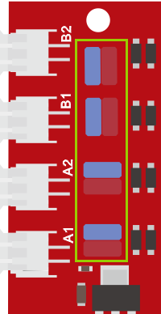
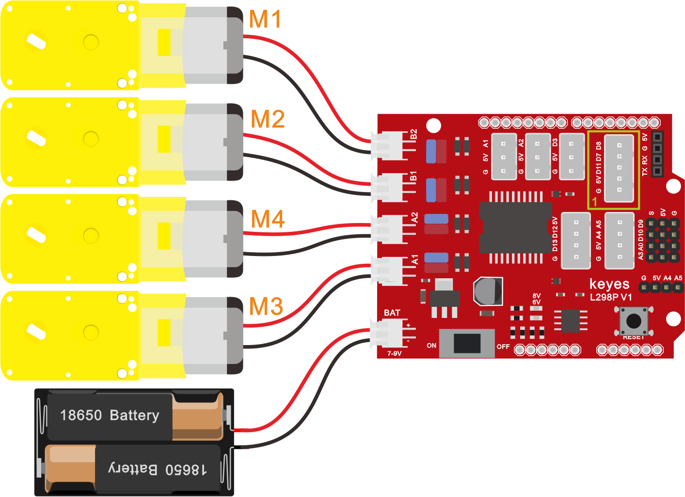
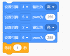
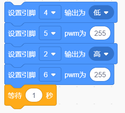
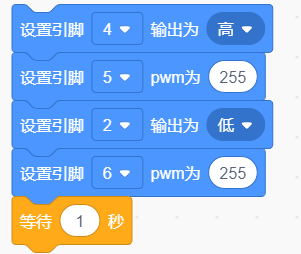
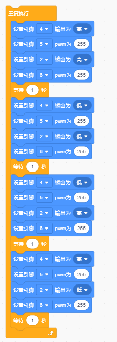
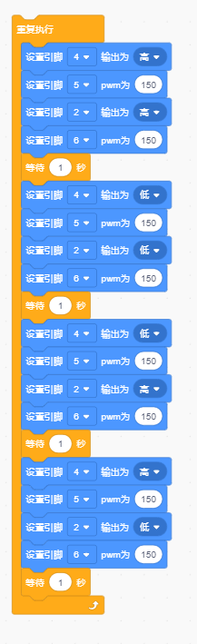

# 第8课 电机控制

## （1）项目介绍：

驱动电机的方法有很多，我们这个智能车用到的是最常用的L298P这个方案，
L298P是ST意法半导体公司出品的优秀大功率电机专用驱动芯片，可直接驱动直流电机、二相、四相步进电机，驱动电流达2A，电机输出端采用8只高速肖特基二极管作为保护。

我们根据L298P的电路设计了一款扩展板，叠层的设计可直接插接到开发板上使用，降低了用户使用和驱动电机的技术难度。我们来看一下这个板子的电路图和示意图：

为了调节小车上的4个电机，使得电机电机的驱动方向与后续的课程代码描述一致。驱动板上自带8个跳线帽，也可用于控制电机转向，例如当MA电机接口前方2个跳线帽由横向连接改为纵向连接时，MA电机的转动方向就和原来的转动方向相反。

## （2）规格参数：

逻辑部分输入电压：DC 5V

驱动部分输入电压：DC 7-12V

逻辑部分工作电流：\<36mA

驱动部分工作电流：\<2A

最大耗散功率：25W（T=75℃）

控制信号输入电平：高电平2.3V\<Vin\<5V  ，低电平-0.3V\<Vin\<1.5V  
工作温度：-25＋130℃

## （3）驱动小车运行原理：

根据上面电机驱动板的电路图和示意图，我们让MA电机的方向引脚在D2，调速引脚在D6，MB电机的方向引脚在D4，调速引脚在D5，按照以下表格的运动逻辑，我们就可以知道如何通过控制数字口，PWM口控制2个电机转动，从而实现智能小车的行走。其中PWM值范围为0-255，设置数值越大，电机转动越快。（A1、A2接左边电机、B1、B2接右边电机）

||D2|D6（PWM）|电机MA|D4|D5（PWM）|电机MB|
|-|-|-|-|-|-|-|
|前进|LOW|200|正转|HIGH|200|正转|
|后退|HIGH|200|反转|LOW|200|反转|
|右旋转|LOW|200|正转|LOW|200|反转|
|左旋转|HIGH|200|反转|HIGH|200|正转|
|停止|/|0|停止|/|0|停止|

## （4）项目组件：

|keyes PLUS 开发板*1|Keyes brick L298P 电机驱动扩展板V1*1|4.5V 200转/分单轴减速箱+双头轴马达+250MM PH2.0mm-2P线材*4|
|-|-|-|
||||
|USB线|18650双节电池盒*1|18650电池*2 （电池自配）|
|||

## （5）接线图：

## （6）项目代码：

在事件栏拖出Arduino启动模块

在控制栏拖出重复循环模块

在引脚栏拖出两个设置引脚高低电平，设置4，2脚为高电平；两个设置引脚PWM，设置5，6脚PWM值为255；在拖出一个延时模块延时1秒（前进代码）

在引脚栏拖出两个设置引脚高低电平，设置4，2脚为低电平；两个设置引脚PWM，设置5，6脚PWM值为255；在拖出一个延时模块延时1秒（后退代码）

在引脚栏拖出两个设置引脚高低电平，设置4脚为低电平，2脚为高电平；两个设置引脚PWM，设置5，6脚PWM值为255；在拖出一个延时模块延时1秒（左转代码）

在引脚栏拖出两个设置引脚高低电平，设置4脚为高电平，2脚为低电平；两个设置引脚PWM，设置5，6脚PWM值为255；在拖出一个延时模块延时1秒（右转代码）

## （7）项目结果：

上传代码成功，上电后，智能车前进1秒，后退1秒，左转1秒，右转1秒，停止1秒，循环。

## （8）项目拓展：

我们来通过调整PWM控制电机的速度，为后面我们控制车速做一个铺垫，接线不变

将PWM的值都调为150。

上传代码成功，怎么样，电机转动的速度是不是慢了很多？

