# 第9课 LED表情灯板

## （1）项目介绍：

如果在我们的机器人上加一块表情面板，这将是多么好玩的一件事情，keyes的8\*16点阵就可以满足你的要求。你可以自己创建面部表情，动画，图案或者是其他有趣的显示。8\*16 LED灯板自带128个LED。微处理器（arduino）的数据通过两线总线接口与AiP1640通讯，从而控制模块上128个LED的亮灭，从而让模块上点阵显示你需要的图案。为方便接线，我们还配送一根HX-2.54 4Pin接线。

## （2）规格参数

工作电压: DC 3.3-5V

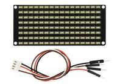功率损耗：400mW

震荡频率：450KHz

驱动电流：200mA

工作温度：-40~80℃

通信方式：I2C通信

## （3）项目组件：

|keyes PLUS 开发板*1|Keyes brick L298P 电机驱动扩展板 V1*1|keyes 8x16 LED灯板*1|
|-|-|-|
|||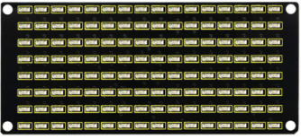|
|USB线*1|18650双节电池盒*1|18650电池*2 （电池自配）|
|||

## （4）8\*16点阵模块详细介绍：

1.  8\*16点阵的电路图：

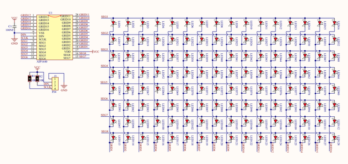

2.  控制8\*16点阵的原理：

是怎么控制8\*16点阵的每个led灯的呢？要知道一个字节有8位，每一位是0或1，0时关闭led，1时打开led灯，那么一个字节就可以控制点阵一列的led灯开关了，自然16个字节就可以控制16列led灯，即控制了8\*16点阵。

3.  接口说明及通讯协议：

微处理器（arduino）的数据通过两线总线接口与AiP1640通讯。

通讯协议图如下(SCLK)就是SCL，(DIN)就是SDA ：

①数据输入的开始条件是，SCL为高电平，SDA由高变低。

②数据命令设置，有下图所示方法可选

我们的示例程序中选择 地址自动加1的方式，其二进制是0100 0000对应的十六进制为0x40

③地址命令设置，有如下图地址可以选

我们示例程序中选了第一个00H，其二进制1100 0000对应的十六进制是0xc0

④数据输入的要求是，在输入数据时当SCL是高电平时，SDA上的信号必须保持不变，只有SCL上的时钟信号为低电平时，SDA上的信号才可以改变。数据的输入是
低位在前，高位在后 传输。

⑤数据传输结束的条件是，SCL为低时，SDA为低，SCL为高时，SDA电平也变为高电平。

⑥显示控制，设置不同脉宽，脉宽有如下图可选

我们示例中选了脉宽为4/16，1000 1010对应的十六进制是0x8A

对应我们的示例程序来学习会理解的更好。

## （5）接线图：

接线注意： 8x16 LED灯板的GND、VCC、SDA、SCL分别对应的接到keyestudio传感器扩展板-（GND）、+（VCC）、A4、A5进行两线串行通信。（注意：这里是接了arduino IIC的引脚，但是这个模块并不是IIC通讯的，是可以接任意两个引脚的。）

## （6）项目代码（点阵显示上面画的微笑表情的代码）

添加点阵代码块（如果没有找到这个模块，请点击右上角的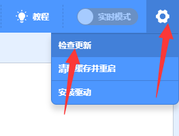）

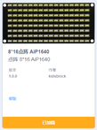

在事件栏拖出Arduino启动模块

在点阵栏拖出初始化点阵模块设置点阵SDA脚为A4，SCL脚为A5

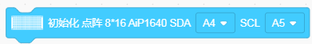

在控制栏拖出重复执行模块

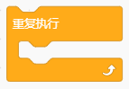

在点阵栏拖出点阵显示模块，并设置显示图案为微笑

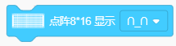

\*\*\*\*\*\*\*\*\*\*\*\*\*\*\*\*\*\*\*\*\*\*\*\*\*\*\*\*\*\*\*\*完整的代码如下\*\*\*\*\*\*\*\*\*\*\*\*\*\*\*\*\*\*\*\*\*\*\*\*\*\*\*\*\*\*\*\*

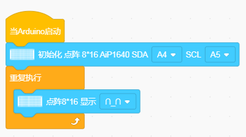

## （7）项目结果：

上传代码到UNO开发板，成功之后，看一下，我们的显示屏上是不是显示了一个笑脸。

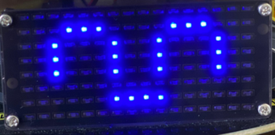

## （8）项目拓展：

我们利用刚刚学到的知识,让点阵循环显示前进图案，后退图案，左转图案，右转图案然后清除图案，时间间隔为1秒。

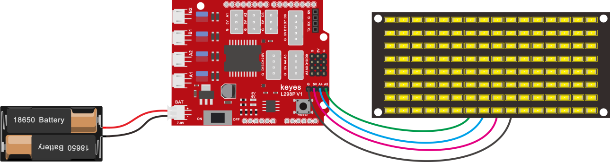

下面就是多个图案切换显示的代码：

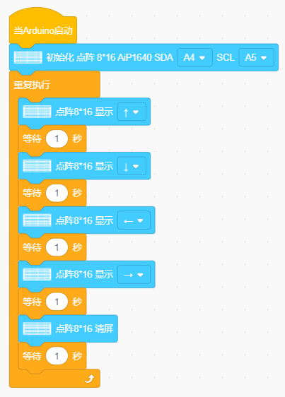

上传代码到开发板，我们看到表情面板（8\*16点阵显示开始前进停止然后清屏的图案，循环反复）。

