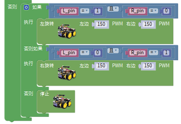

# 第11课 循线智能车

## （1）项目介绍：

前面我们详细的介绍了画地为牢智能车的实现方法。在这里我们可以结合前面课程中知识制作一个循迹智能车。实验中，我们还是通过循迹传感器检测智能车底部是否存在黑线，然后根据检测结果控制两个电机的转动，从而控制智能车沿着黑线行走。

## （2）流程图：

循迹智能车具体逻辑如下表格。

|检测|中循迹传感器|检测到黑线：高电平|
|-|-|-|
|检测|中循迹传感器|检测到白线：低电平|
|检测|左循迹传感器|检测到黑线：高电平|
|检测|左循迹传感器|检测到白线：低电平|
|检测|右循迹传感器|检测到黑线：高电平|
|检测|右循迹传感器|检测到白线：低电平|

|条件|状态||
|-|-|-|
|中循迹传感器检测到黑线|左循迹传感器检测到黑线并且右循迹传感器检测到白线|左旋转（PWM设为200）|
|中循迹传感器检测到黑线|左循迹传感器检测到白线并且右循迹传感器检测到黑线|右旋转（PWM设为200）|
|中循迹传感器检测到黑线|左循迹传感器检测到白线并且右循迹传感器检测到白线|前进|
|中循迹传感器检测到黑线|左循迹传感器检测到黑线并且右循迹传感器检测到黑线|前进|
|中循迹传感器检测到白线|左循迹传感器检测到黑线并且右循迹传感器检测到白线|左旋转（PWM设为200）|
|中循迹传感器检测到白线|左循迹传感器检测到白线并且右循迹传感器检测到黑线|右旋转（PWM设为200）|
|中循迹传感器检测到白线|左循迹传感器检测到白线并且右循迹传感器检测到白线|停止|
|中循迹传感器检测到白线|左循迹传感器检测到黑线并且右循迹传感器检测到黑线|停止|

按照前面思路设计好智能车后，我们就需要按照设计思路开始制作智能车。我们需要设计对应的接线，测试代码，然后接线上传代码，运行，确保智能车能够实现理想中的功能。

## （3）接线图：

巡线模块+电机

接线注意：用导线把循迹模块连接到电机驱动扩展板上P1接口的G、V、D11、D7、D8；(M1、M2)和(M3、M4)两对时电机分别对应的连接到电机驱动扩展板上的接口B和接口A，电源接到BAT接口。

## （4）测试代码：

|①初始化||
|-|-|
|②设置变量L_pin、M_pin、R_pin为整数并赋值为0||
|③将三个循迹传感器的值赋值给对应的变量L_pin、M_pin、R_pin中||
|④判断中间的循迹传感器是否感应到黑线||
|⑤判断左边循迹传感器感应到黑线，右边没有感应到黑线||
|⑥4WD小车以PWM150的速度左转||
|⑦判断右边循迹传感器感应到黑线，左边没有感应到黑线||
|⑧4WD小车以PWM150的速度右转||
|⑨4WD小车以PWM150的速度前进||
|⑩当中间的循迹传感器没有感应到黑线时，判断左边循迹传感器感应到黑线，右边没有感应到黑线||
|⑪4WD小车以PWM150的速度左转||
|⑫判断右边循迹传感器感应到黑线，左边没有感应到黑线||
|⑬4WD小车以PWM150的速度右转||
|⑭上面条件都不满足时4WD小车停止||

完整代码：

## （5）测试结果：

将驱动扩展板堆叠在UNO Plus板上，上传好代码，按照接线图接线，将拨码开关拨至ON端后，智能车能够沿着黑线行走。

