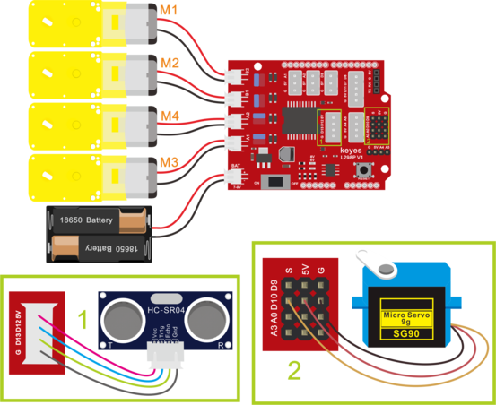
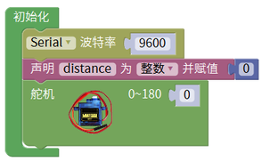
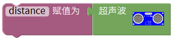
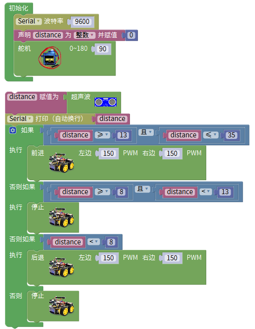

# 第12课 超声波跟随智能车

## （1）项目介绍：

我们结合硬件知识-各种传感器，模块，电机驱动器，来制造超声波跟随机器人车！

实验中，我们通过避障传感器检测智能车左右两方是否存在障碍物，检测智能车和前方障碍物的距离，然后根据这三个数据控制两个电机的转动，从而控制智能车的运动状态。

## （2）流程图：

跟随智能车具体逻辑如下表格。

|检测|超声波测试前方物体距离|distance（单位：cm）|
|-|-|-|
|条件|distance<8|
|状态|后退（PWM设为100）|
|条件|8＜distance≤13|
|状态|停止|
|条件|13≤distance≤35并且l_val=1并且r_val=1|
|状态|前进（PWM设为100）|
|条件|distance＞35|
|状态|停止|

按照前面思路设计好智能车后，我们就需要按照设计思路开始制作智能车。我们需要设计对应的接线，测试代码，然后接线上传代码，运行，确保智能车能够实现理想中的功能。

## （3）接线图：超声波模块+电机+红外避障传感器

接线注意：A、B两电机分别对应的连接电机驱动扩展板上的接口A和接口B；超声波传感器模块的V引脚至V，T（Trig）引脚至数字12(S)，E（Echo）引脚至数字13(S)，G引脚至G；电源接到BAT接口。

## （4）测试代码：

①初始化
②设置串口波特率为9600
③设置变量distance为整数并赋值为0
④舵机设置的角度为90

⑤将超声波传感器测到的距离赋给变量distance

⑥当距离≥13cm且距离≤35cm成立时，就执行do中的命令（代码）

⑦小车以PWM150的速度前进

⑧当距离≥8cm且距离<13cm成立时，就执行do中的命令（代码）

⑨小车停止

⑩当距离<8cm成立时，就执行do中的命令（代码）

⑪小车以PWM150的速度后退

⑫当上述条件都未成立时，就执行else中的命令（代码），小车停止

完整代码：

## （5）测试结果：

将驱动扩展板堆叠在UNO Plus板上，上传好代码，按照接线图接线，将拨码开关拨至ON端后，智能车能够随着前方障碍物的移动而移动。

