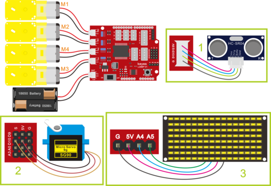
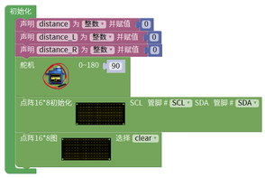
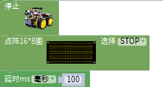
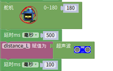
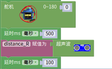
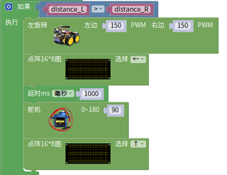
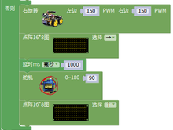
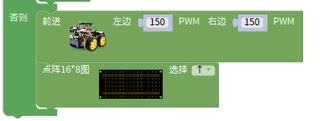
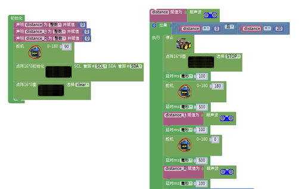

# 第13课 自动避障智能车

## （1）项目介绍：

在上课程中，我们制作了一个跟随智能车。实际上，利用同样的电子元件，同样的接线方法，我们只需要更改一个测试代码就可以将跟随智能车变为避障智能车。

## （2）流程图：

避障智能车具体逻辑如下表格。

|检测|左边障碍物距离|distance_l（单位：cm）|
|-|-|-|
|检测|右边障碍物距离|distance_r（单位：cm）|
|检测|中间障碍物距离|distance（单位：cm）|
|条件|状态||
|0<distance<20|distance_l > distance_r 如果左边大于右边|向左转|
|0<distance<20|distance_l<=distance_r 如果左边不大于右边|向右转|
|distance>=20|前进|

使用的电子元件，接线方法和课程四一样，更换测试代码，运行，确保智能车能够实
现理想中的功能。

## （3）接线图：超声波模块+电机+舵机

接线注意：A、B两电机分别对应的连接电机驱动扩展板上的接口A和接口B；超声波传感器模块的V引脚至V，T（Trig）引脚至数字12(S)，E（Echo）引脚至数字13(S)，G引脚至G；电源接到BAT接口，舵机S接D10。

## （4）测试代码

①初始化
②设置变量distance为整数并赋值为0
③设置变量distance_L为整数并赋值为0 ④设置变量distance_R为整数并赋值为0 ⑥舵机的角度设置为90 设置点阵8x16的SDA，SCL 点阵清屏

⑦给distance赋值距离

⑧判断距离是否大于0小于20，然后再执行语句

⑨停止小车，点阵显示STOP并延时100毫秒

⑩舵机旋转到180度延时500毫秒，然后将读取到的距离赋值给distance_L，在延时100毫秒

⑪舵机旋转到0度，延时500毫秒，然后将读取到的距离赋值给distance_R，在延时100毫秒

⑫判断distance_L的距离是否比distance_R远 如果是：就执行小车左转，点阵显示左箭头 延时1000毫秒后，舵机旋转到90度点阵显示向前箭头

⑬如果不是：小车就右转，点阵显示右转箭头 延时1000毫秒后，舵机转到90度，点阵显示向前箭头

⑮如果上面的条件都不满足，那小车就前进，点阵显示前进箭头

完整代码：

## （5）测试结果

将驱动扩展板堆叠在UNO Plus板上，上传好代码，按照课程三接线图接线，将拨码开关拨至ON端后，智能车能够自动避开障碍物行走。

