# 第14课 红外遥控智能车

## （1）项目介绍：

前面的学习中我们详细的介绍了智能车上各个传感器、模块、扩展板的使用方法。在这里我们可以再结合前面课程中知识制作一个红外控制智能车。在传感器项目第四课中，我们已经测试出红外遥控器各个按键对应的键值。实验中，我们可以通过代码设置（键值），让对应的按键控制智能车对应的运动状态，且相应的状态模式显示在8X16 LED矩阵上。

## （2）流程图：

循迹智能车具体逻辑如下表格：

|按键：|键值：FF629D|状态：前进|
|-|-|-|
|按键：|键值：FFA857|状态：后退|
|按键：|键值：FF22DD|状态：左转|
|按键：|键值：FFC23D|状态：右转|
|按键：|键值：FF02FD|状态：停止|

按照前面思路设计好智能车后，我们就需要按照设计思路开始制作智能车。我们需要设计对应的接线，测试代码，然后接线上传代码，运行，确保智能车能够实现理想中的功能。

## （3）接线图：电机+红外接收模块

接线注意：由于红外接收传感器输入的数字信号，将红外接收传感器模块用导线连接到电机驱动扩展板上的G、V、A1
; A、B两组电机分别对应的连接到堆叠在UNO Plus板上的电机驱动扩展板上的接口A和接口B，电源接到BAT接口。

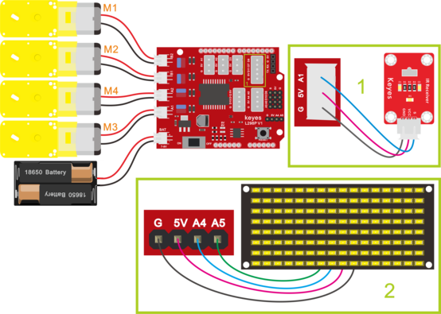

## （4）测试代码：

①初始化
②设置串口波特率为9600
③设置点阵8x16的时钟（SCL）引脚为SCL，数据（SDA）引脚为SDA；SCL相对应主板上的A5，SDA相对应主板上的A4。
④点阵8x16清屏
⑤点阵8x16显示“V”图案
⑥舵机设置的角度为90
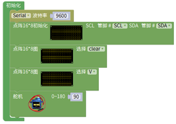

⑥红外接收模块信号端接收红外遥控信号并在串口监视器中以十六进制数字打印出来
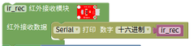

⑦当红外遥控信号=0xFF629D成立时，就执行do中的命令（代码）

⑧小车以PWM200的速度前进，点阵8x16显示“↑”图案
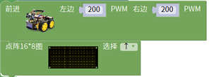

⑦当红外遥控信号=0xFFA857成立时，就执行do中的命令（代码）

⑧小车以PWM200的速度后退，点阵8x16显示“↓”图案
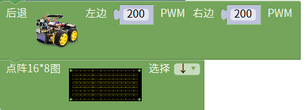

⑩当红外遥控信号=0xFF22DD成立时，就执行do中的命令（代码）

⑪小车左转弯，点阵8x16显示“←”图案
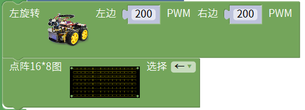

⑬当红外遥控信号=0xFFC23D成立时，就执行do中的命令（代码）

⑭小车右转弯，点阵8x16显示“→”图案
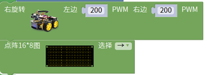

⑯当红外遥控信号=0xFF02FD成立时，就执行do中的命令（代码）

⑰小车停止，点阵8x16显示“STOP”图案
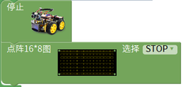

⑲当红外遥控信号=0xFF30CF成立时，就执行do中的命令（代码）

⑳小车以PWM200的速度左旋转，点阵8x16显示“←”图案
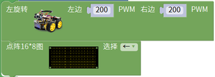

㉒当红外遥控信号=0xFF7A85成立时，就执行do中的命令（代码）

㉓小车以PWM200的速度右旋转，点阵8x16显示“→”图案
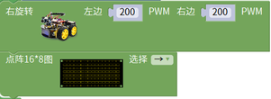

（注意：在上传测试代码前，需要把蓝牙模块取下，否则测试代码会上传失败。需要上传代码成功后，再连接蓝牙模块。）

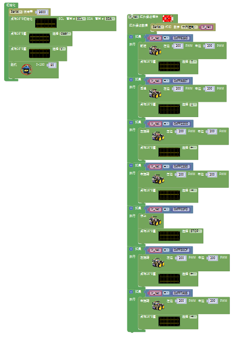

## （5）测试结果：

将驱动扩展板堆叠在UNO Plus板上，上传好代码，按照接线图接线，将拨码开关拨至ON端后，我们就能用红外遥控控制智能车运动了。

