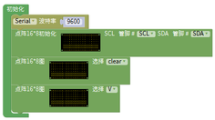
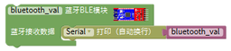
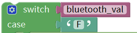
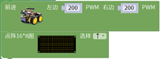
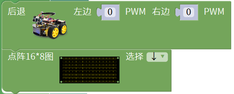
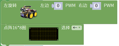
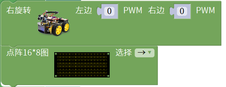
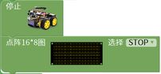
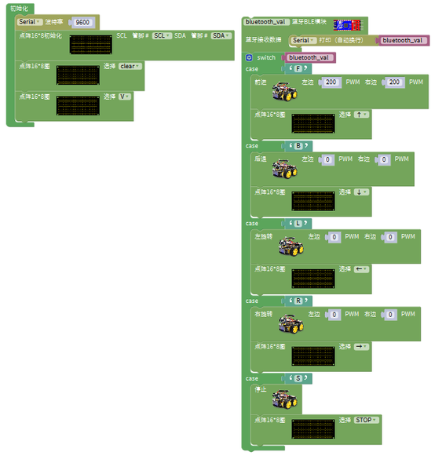

# 第15课 蓝牙遥控智能车

## （1）项目介绍：

前面课程中，我们利用红外控制智能车运动，在这课程中我们可以做一个蓝牙控制智能车。既然是控制智能车，那就有一个控制端和被控制端。课程中我们把手机当做控制端（主机），蓝牙模块（从机）连接的智能车当做被控制端。使用时，我们需要在手机上安装一个APP，然后连接蓝牙模块，然后我们利用蓝牙APP上各个按钮，控制智能车实现各种运动状态。

## （2）流程图：

先取下蓝牙模块，程序代码上传后，再连接蓝牙模块和打开串口监视器，设置波特率为9600。对准蓝牙模块按下手机APP按钮，我们可以看到APP按钮对应的控制字符，如下图。

经过测试，我们得出了手机APP上各个按钮对应的控制字符和各个按钮对应的功能，这里我们整理了一个表格如下：

|按钮:|功能：配对连接蓝牙模块||
|-|-|-|
|按钮:|功能：进入蓝牙控制界面|
|按钮:|功能：断开蓝牙连接|
|按钮:|控制字符：按下：F；松开：S|功能：按下，小车前进；松开就停止|
|按钮:|控制字符：按下：B；松开：S|功能：按下，小车后退；松开就停止|
|按钮:|控制字符：按下：L；松开：S|功能：按下，小车左旋转；松开就停止|
|按钮:|控制字符：按下：R；松开：S|功能：按下，小车右旋转；松开就停止|
|按钮:|控制字符：按下：a；松开：S|功能：点击，加速，最大加到255|
|按钮:|控制字符：按下：d；松开：S|功能：点击，减速，最小减到0|
|按钮:|控制字符：|功能：点击一下开启手机方向感应控制，再点击一下退出方向感应控制|
|按钮:|控制字符：点击发送：Y,再次电机发送S|功能：开启避障功能，再次点击退出|
|按钮:|控制字符：点击发送：X,再次电机发送S|功能：开启循线功能，再次点击退出|
|按钮:|控制字符：点击发送：U,再次电机发送S|功能：开启超声波跟随功能，再次点击退出|
|按钮:|控制字符：点击发送：G,再次电机发送S|功能：开启画地为牢功能，再次点击退出|

## （4）接线图：蓝牙+电机

接线注意：
蓝牙模块的RXD、TXD、GND、VCC分别对应的接到电机驱动扩展板上的TX、RX、-（GND）、+（VCC），而蓝牙模块的STATE和BRK两引脚不需要接，电源接到BAT接口。

1.  B两电机分别对应的连接到电机驱动扩展板上的接口A和接口B；蓝牙模块的RXD、TXD、GND、VCC分别对应的接到电机驱动扩展板上的TX、RX、-（GND）、+（VCC），而蓝牙模块的STATE和BRK两引脚不需要接，电源接到BAT接口。

## （5）测试代码：

①初始化
②设置串口波特率为9600
③设置点阵8x16的时钟（SCL）引脚为SCL，数据（SDA）引脚为SDA；SCL相对应主板上的A5，SDA相对应主板上的A4。
④点阵8x16清屏
⑤点阵8x16显示“V”图案

⑥蓝牙BLE模块接收蓝牙数据并在串口监视器中读取打印出来

⑦变量bluetooth_val的值与各个case逐个进行比较

⑧当变量bluetooth_val的值是F时,执行case下的命令（代码）并退出switch-case语句体
⑨小车以PWM200的速度前进

⑩点阵8x16显示“↑”图案
⑪当变量bluetooth_val的值是B时,执行case下的命令（代码）并退出switch-case语句体

⑫小车以PWM200的速度后退

⑬点阵8x16显示“↓”图案
⑭当变量bluetooth_val的值是L时,执行case下的命令（代码）并退出switch-case语句体

⑮小车以PWM250的速度左旋转

⑯点阵8x16显示“←”图案
⑰当变量bluetooth_val的值是R时,执行case下的命令（代码）并退出switch-case语句体

⑱小车以PWM250的速度右旋转 ⑲点阵8x16显示“→”图案

⑳当变量bluetooth_val的值是S时,执行case下的命令（代码）并退出switch-case语句体

㉑小车停止
㉒点阵8x16显示“STOP”图案

完整代码：

好了，按住蓝牙APP的前进、后退、左转弯、右转弯、停止、左旋转、右旋转的按钮控制桌面迷你蓝牙智能车分别前进、后退、左转弯、右转弯、停止、左旋转、右旋转的程序代码全编写完了。上传程序，看看效果。（在上传测试代码前，需要把蓝牙模块取下，否则代码会上传失败。需要上传代码成功后，再连接蓝牙模块。）

## （6）测试结果：

将驱动扩展板堆叠在UNO Plus板上，上传好代码，按照接线图接线，将拨码开关拨至ON端后，手机APP连接蓝牙成功后，我们就能用手机APP控制智能车运动并在LED灯板上显示对应的图案了。

按下按钮，小车前进；按下按钮，小车后退；按下按钮，小车左旋转；按下按钮，小车右旋转；点击一下按钮，开启手机方向感应控制，再点击一下按钮，退出方向感应控制。

