# 第16课 蓝牙调速智能车

## （1）项目介绍：

前面课程中，我们利用蓝牙控制智能车，在这课程中我们做一个蓝牙可以控制速度的智能车。既然要控制智能车速度，我们可以将速度定义一个变量speeds来表示。项目中我们只要改变这是变量speeds就可以改变智能车的速度啦。下面让我们通过代码来实现。

## （2）流程图：

按照前面思路设计好智能车后，我们就需要按照设计思路开始制作智能车。我们需要设计对应的接线，测试代码，然后接线上传代码，运行，确保智能车能够实现理想中的功能。

## （3）接线图：蓝牙+电机

接线跟上一课一样

## （4）测试代码：

①初始化
②设置串口波特率为9600
③设置点阵8x16的时钟（SCL）引脚为SCL，数据（SDA）引脚为SDA；SCL相对应主板上的A5，SDA相对应主板上的A4。
④点阵8x16清屏
⑤点阵8x16显示“V”图案；声明speeds、speed_L、speed_R为整数并赋值150
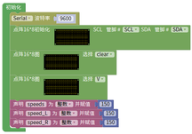

⑥蓝牙BLE模块接收蓝牙数据并在串口监视器中读取打印出来

⑦变量bluetooth_val的值与各个case逐个进行比较
⑧当变量bluetooth_val的值是F时,执行case下的命令（代码）并退出switch-case语句体

⑨小车以PWM：speed_L、speed_R的速度前进
⑩点阵8x16显示“↑”图案
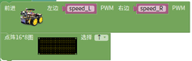

⑪当变量bluetooth_val的值是B时,执行case下的命令（代码）并退出switch-case语句体

⑫小车以PWM：speed_L、speed_R的速度后退
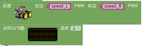

⑬点阵8x16显示“↓”图案
⑭当变量bluetooth_val的值是L时,执行case下的命令（代码）并退出switch-case语句体

⑮小车以PWM：speed_L、speed_R的速度左旋转
⑯点阵8x16显示“←”图案
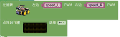

⑰当变量bluetooth_val的值是R时,执行case下的命令（代码）并退出switch-case语句体

⑱小车以PWM250的速度右旋转 ⑲点阵8x16显示“→”图案

当变量bluetooth_val的值是a时,执行case下的命令（代码）并退出switch-case语句体

按下加速按键，当speed小于255时，speed加一并延时10毫秒
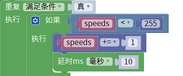

把速度分别赋值给左右电机（speed_L,speed_R） 由于电机之间的实际诧异调整speed_L的速度加10已达到转速相等，但是当速度加到最大时speed_L的值会比255大所以我们设置了一个条件语句不让它大于255
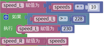

通过串口打印左右电机的PWM值，方便调整
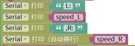

当串口读取到“S”时，跳出循环，因为我们最开始时加了一个无限循环
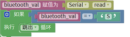

当变量bluetooth_val的值是d时,执行case下的命令（代码）并退出switch-case语句体

按下加速按键，当speed大于0时，speed减一并延时10毫秒
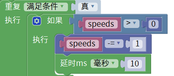

把速度分别赋值给左右电机（speed_L,speed_R） 由于电机之间的实际诧异调整speed_L的速度加10已达到转速相等，但是当速度加到最大时speed_L的值会比255大所以我们设置了一个条件语句不让它大于255

通过串口打印左右电机的PWM值，方便调整

当串口读取到“S”时，跳出循环，因为我们最开始时加了一个无限循环

当变量bluetooth_val的值是S时,执行case下的命令（代码）并退出switch-case语句体

小车停止
点阵8x16显示“STOP”图案

完整代码：（注意上传代码的时候必须拔下蓝牙模块不然会上传不成功的，上传完在装回去）

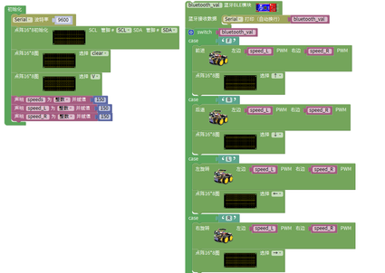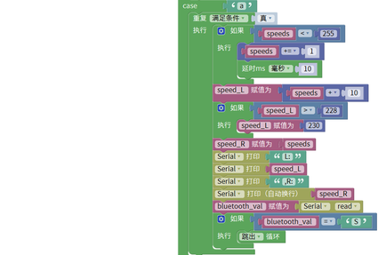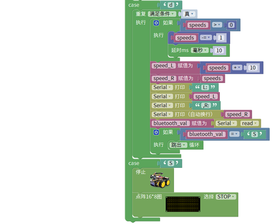

## （5）测试结果：

按下按钮，小车加速；按下按钮，小车减速.

