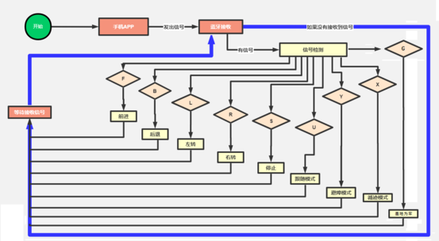
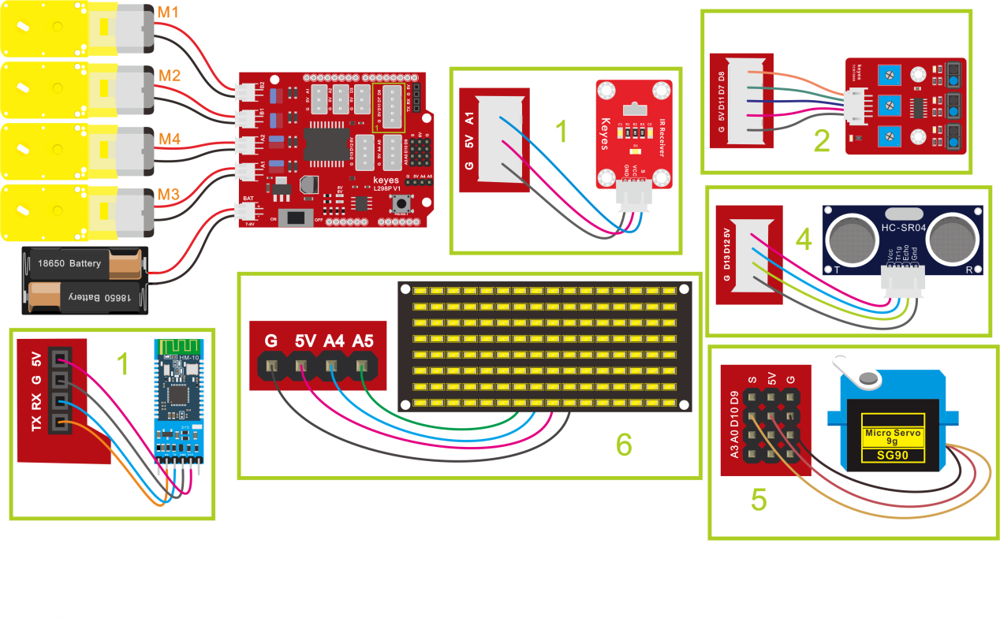
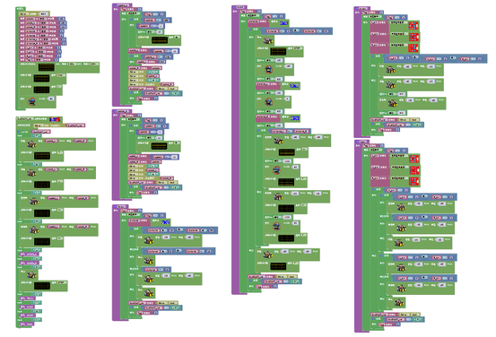

# 第17课 多功能智能小车

## （1）项目介绍：

在前面课程中，我们只是让智能车实现单个功能，那我们能不能把所有功能合在一起呢？能，在这一课程中，我们利用一个代码测试智能车，智能车包含前面课程中讲到的所有功能，我们利用手机蓝牙APP上按钮自动切换各种功能,简单方便。

## （2）流程图：

按照前面思路设计好智能车后，我们就需要按照设计思路开始制作智能车。我们需要设计对应的接线，测试代码，然后接线上传代码，运行，确保智能车能够实现理想中的功能。

## （3）接线图：

接线注意：

循迹模块连接到电机驱动扩展板上P1接口的G、V、D11、D7、D8；

超声波传感器模块的VCC引脚连接至连接到电机驱动扩展板上，V引脚至V，T（Trig）引脚至数字12(S)，E（Echo）引脚至数字13(S)，G引脚至G；

红外接收传感器模块用导线连接到电机驱动扩展板上的G、V、A1；（M1、M2），（M3、M4）两组电机分别对应的连接到电机驱动扩展板上的接口B和接口A；

舵机接数字口10；

LED点阵屏接A4、A5管脚（不一定要接IIC引脚）；

蓝牙模块的RXD、TXD、GND、VCC分别对应的接到电机驱动扩展板上的TX、RX、-（GND）、+（VCC），而蓝牙模块的STATE和BRK两引脚不需要接，电源接到BAT接口。

## （4）测试代码：

好了，蓝牙多功能控制智能车的程序都已经编写好了，上传程序，实际操作下看看效果。（在上传程序代码前，需要把蓝牙模块取下，否则代码会上传失败。需要上传代码成功后，再连接蓝牙模块。）

## （5）测试结果：

将驱动扩展板堆叠在UNO Plus板上，上传好代码，按照接线图接线，将拨码开关拨至ON端后，手机APP连接蓝牙成功后，我们就能用手机APP控制智能车运动了。我们可以通过按下对应按钮实现对应功能，通过停止钮来停止功能。

注意：利用安卓系统手机APP点击，测试语音控制时，不能实现语音控制功能。

