# 第5课 超声波测距

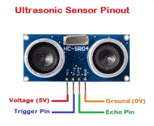

## （1）项目介绍：

HC-SR04超声波测距模块可提供2cm-400cm的非接触式距离感测功能，测距精度可达高到3mm；模块包括超声波发射器、接收器与控制电路。像智能小车的测距以及转向，或是一些项目中，常常会用到。智能小车测距可以及时发现前方的障碍物，使智能小车可以及时转向，避开障碍物，所以，我们今天就来学习一下这个传感器。

## （2）超声波参数：

电源：+ 5V DC

静态电流：\<2mA

工作电流：15mA

有效角度：\<15°

测距范围：2cm – 400 cm

分辨率：0.3厘米

测量角度：30度

触发输入脉冲宽度：10uS

## （3）项目组件：

|keyes PLUS 开发板*1|Keyes brick L298P 电机驱动扩展板V1*1|keyes 草帽LED白发红模块*1|HC-SR04超声波传感器*1|
|-|-|-|-|
|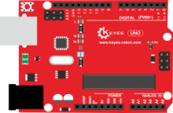|||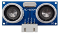|
|HX-2.54 4P 双头 连接线*1|3Pin 双母头杜邦线*1|USB线*1|18650双节电池盒*1|18650电池*2 （电池自配）|
|||||

## （4）超声波模块知识：

原理：看超声波的图可知，像是有两个眼睛，其一边是发射超声的，一边是接收超声波的，然后检测从发射遇到障碍物返回被接收到所需的时间t，再根据声音在空气中的传播速度大概是343m/s,
距离 = 速度 \* 时间 ，
由于超声波发射返回是两段路程了，所以需要除以2，故超声波测到的 距离
=（速度 \* 时间）/2

超声波模块的使用方法及时序图：

1、使用GPIO引脚给SR04的Trig引脚至少10μs的高电平信号，触发SR04模块测距功能；

2、触发后，模块会自动发送8个40KHz的超声波脉冲，并自动检测是否有信号返回。这步会由模块内部自动完成。

3、如有信号返回，Echo引脚会输出高电平，高电平持续的时间就是超声波从发射到返回的时间。

超声波模块的电路图

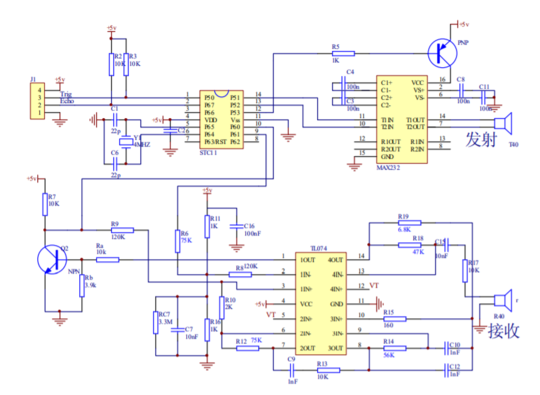

## （5）接线图：

接线注意：超声波传感器模块的VCC引脚连接至keyestudio V5
传感器扩展板的5v(V)，Trig引脚至数字12(S)，Echo引脚至数字13(S)，Gnd引脚至Gnd(G)。

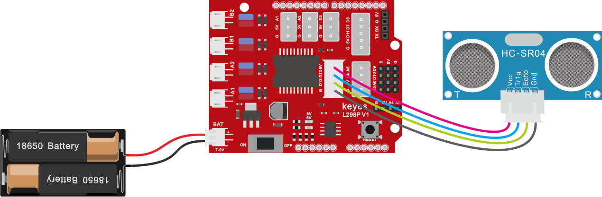

## （6）项目代码：

|①初始化||
|-|-|
|②设置串口波特率为9600||
|③在变量栏目下拖出声明变量模块，设置变量distance1为整数并赋值0||
|④在变量栏目下拖出声明变量模块，设置变量distance2为整数并赋值0||
|⑤将超声波传感器测量的距离（cm）赋给于变量distance1|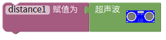|
|⑥变量distance2赋值为变量distance1×0.3937|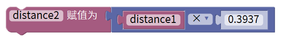|
|⑦串口打印变量distance2的值||
|⑧串口打印字符in,||
|⑨串口打印变量distance1的值||
|⑩串口打印字符cm||
|⑪延时时间为250毫秒||

\*\*\*\*\*\*\*\*\*\*\*\*\*\*\*\*\*\*\*\*\*\*\*\*\*\*\*\*\*\*\*\*完整的代码如下\*\*\*\*\*\*\*\*\*\*\*\*\*\*\*\*\*\*\*\*\*\*\*\*\*\*\*\*\*\*\*\*

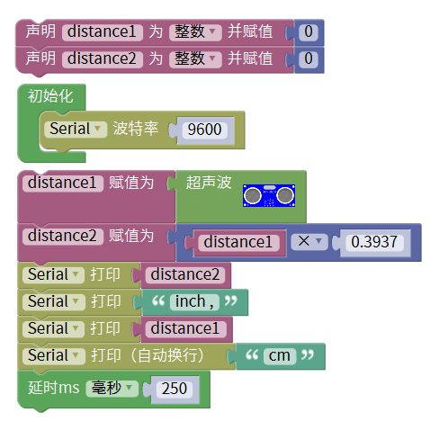

...................①初始化

...................②设置串口波特率为9600

...................③设置变量distance1为整数并赋值0

...................④设置变量distance2为整数并赋值0

...................⑤将超声波传感器测量的距离（cm）赋给于变量distance1

...................⑥变量distance2赋值为变量distance1×0.3937

...................⑦串口打印变量distance2的值

...................⑧串口打印字符in,

...................⑨串口打印变量distance1的值

...................⑩串口打印字符cm

...................⑪延时时间为250毫秒

## （7）项目结果：

上传好测试代码到开发板，打开串口监视器，设置波特率为9600，我们可以看到超声波模块显示的距离，单位是厘米和英寸。用手阻挡超声波模块，我们看到显示距离的数值变小了。

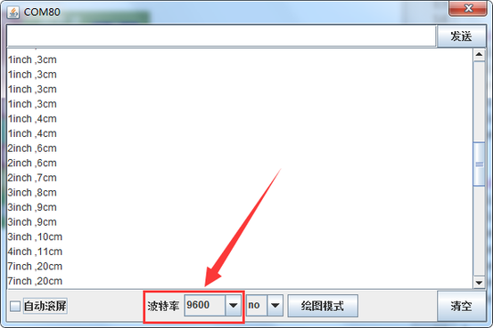

## （8）项目拓展：

我们刚刚测出了超声波显示的距离，那我们动动脑筋，能不能用测出的距离来做一些控制呢，如果控制一个LED灯的亮和灭。我们来试一下，在D9脚接上一个LED灯模块。

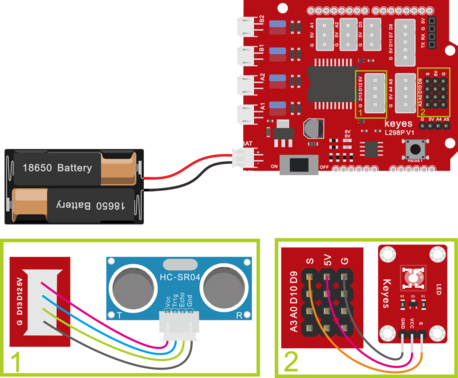

|①初始化||
|-|-|
|②设置串口波特率为9600||
|③在变量栏目下拖出声明变量模块，设置变量distance1为整数并赋值0||
|④在变量栏目下拖出声明变量模块，设置变量distance2为整数并赋值0||
|⑤将超声波传感器测量的距离（cm）赋给于变量distance1||
|⑥变量distance2赋值为变量distance1×0.3937||
|⑦串口打印变量distance2的值||
|⑧串口打印字符in,||
|⑨串口打印变量distance1的值||
|⑩串口打印字符cm||
|⑪延时时间为250毫秒||
|⑫在控制栏目里面找到如果--执行这个模块，在逻辑栏目里面找到且这个模块，如果条件distance1≥2且distance1≤10成立时，就执行里面的命令（代码）||
|⑬点亮D9引脚上的红色LED ⑭延时时间1000毫秒 ⑮熄灭D9引脚上的红色LED ⑯延时时间1000毫秒|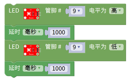|

\*\*\*\*\*\*\*\*\*\*\*\*\*\*\*\*\*\*\*\*\*\*\*\*\*\*\*\*\*\*\*\*完整的代码如下\*\*\*\*\*\*\*\*\*\*\*\*\*\*\*\*\*\*\*\*\*\*\*\*\*\*\*\*\*\*\*\*

上传好测试代码到开发板，我们用手去靠近超声波传感器，看LED
灯亮起来了没有。

