# 蓝牙多功能车介绍

4WD 蓝牙多功能智能车是基于 Arduino 的开源机器人，可以让孩子们轻松学习编程，并获得有关电子、机械、控制逻辑和计算机科学的实践知识。

他的安装和接线也十分简单，组件都通过螺钉和铜柱连接，只需要几个简单的步骤就可以组装完成。它提供了十多个编程的课程项目，由简单到复杂，让学生一步一步学习如何编写机器人能“听”懂的语言。

## 特点 

1. **功能多样**：避障功能、跟随功能、红外遥控、蓝牙控制、循迹功能、显示图案等。
2. **组装简单**：无需焊接电路，只需几个简单的步骤即可组装该机器人。
3. **结构坚固**：车身部分采用 PCB 材质，电机使用优质金属电机。
4. **扩展性强**：配置电机驱动扩展板，可扩展其他传感器和模块。
5. **多种控制方式**：支持红外遥控器和手机遥控（兼容苹果和安卓手机）。
6. **学习基础编程**：使用 Arduino IDE 的 C 语言编程，可以接触底层代码。

## 参数 

- **工作电压**：5V
- **输入电压**：7-12V
- **最大输出电流**：1A
- **最大耗散功率**：25W（T=75℃）
- **电机转速**：5V 63 rpm/min
- **电机驱动形式**：双路 H 桥驱动
- **超声波感应角度**：<15度
- **超声波探测距离**：2cm-400cm
- **红外遥控距离**：10米（实测）
- **蓝牙遥控距离**：50米（实测）
- **蓝牙 APP 控制**：支持 Android 和 iOS 系统
- **可接入外部 DC 7~12V 的电压。**

## 清单 

当收到这个智能车套件时，您会看到一个包装精美的外盒，每个配件都被安全且有序地装在外盒里面的小盒子里。先来清点一下配件清单：

| No   | 产品名称                                                    | 数量     | 图片                                           |
| ---- | ---------------------------------------------------------- | -------- | --------------------------------------------- |
| 1    | Keyes UNO R3 for Arduino 开发板                           | 1        | 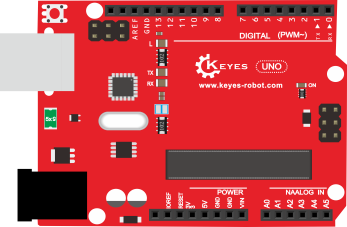 |
| 2    | 4WD车前面LED屏亚克力挡板 73*44MM 黑色半透明 T=3MM 环保     | 1        | 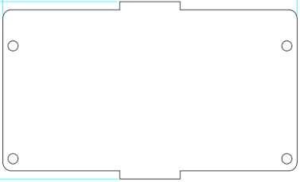 |
| 3    | Keyes brick L298P 电机驱动扩展板 V1                       | 1        |  |
| 4    | Keyes Bluetooth-4.0 蓝牙4.0 V2                            | 1        | 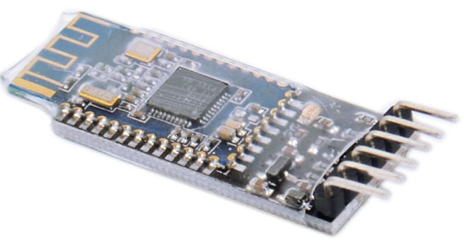 |
| 5    | HC-SR04 超声波传感器                                       | 1        |  |
| 6    | Keyes 草帽 LED 白发红模块                                   | 1        |  |
| 7    | 3Pin 双母头杜邦线 长 20CM 2.54mm                          | 2        | 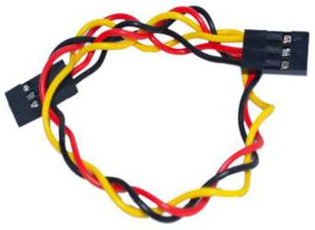 |
| 8    | Keyestudio 4WD 智能车 V3.0 PCB板 (上板)                   | 1        | 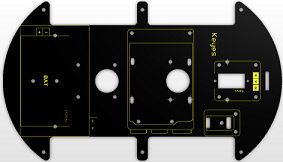 |
| 9    | Keyestudio 4WD 智能车 V3.0 PCB板 (下板)                   | 1        | 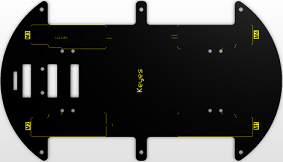 |
| 10   | Keyes connectors 循迹传感器                                  | 1        |  |
| 11   | Keyes brick 红外接收传感器                                   | 1        | 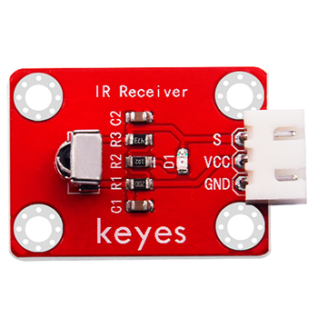 |
| 12   | 云台支架（黑色）配套 固定孔 3MM                             | 1        | 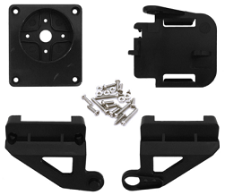 |
| 13   | SG90 9G 23*12.2*29mm 蓝色 辉盛 180度 环保                    | 1        | 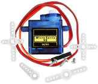 |
| 14   | 18650双节15CM露线适用DIY小车+双头PH2.0MM-2P 红黑线 (总线长 115MM) | 1        | 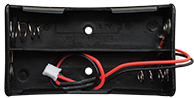 |
| 15   | 6节5号带线15CM露线+双头PH2.0MM-2P 红黑线 (总线长 115MM)环保  | 1        | 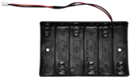 |
| 16   | Keyestudio 8x16 LED 灯板 黑色 环保                         | 1        | 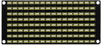 |
| 17   | 23*15*5MM 间距9MM 铝 氧化黑色                               | 1        | 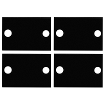 |
| 18   | 直径：43mm 宽度：19mm 孔径：3mm D型孔 ABS塑料+橡胶 黄色      | 4        | 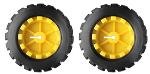 |
| 19   | 双通 M3*10MM                                               | 8        | 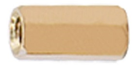 |
| 20   | 双通 M3*40MM                                               | 6        |  |
| 21   | M3*30MM 圆头 十字                                         | 8        | 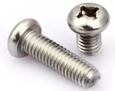 |
| 22   | M3*6MM 圆头 十字                                          | 45       |  |
| 23   | M3 镀镍                                                   | 20       | 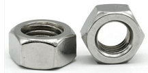 |
| 24   | 3*40MM 红黑色 十字螺丝刀                                  | 1        | 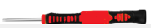 |
| 25   | M2*8MM 圆头 十字                                          | 10       |  |
| 26   | M2 镀镍                                                   | 10       |  |
| 27   | M3*10MM 平头                                             | 3        |  |
| 28   | 4.5V 200转/分 单轴减速箱 + 双头轴马达 + 250MM PH2.0mm-2P线材 环保 | 4        | 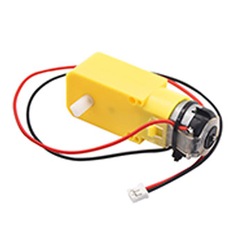 |
| 29   | 5P XH2.54 转 PH2.0 26AWG 线长200MM 反向                    | 1        | 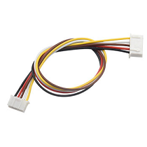 |
| 30   | HX-2.54 3P 双头 26AWG 黑红白 100mm                          | 1        | 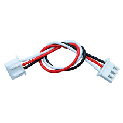 |
| 31   | HX-2.54 4P 双头 26AWG 黑棕白红 200mm 反向                   | 1        | 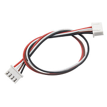 |
| 32   | HX-2.54 4P 转 杜邦线母单 26AWG 黑红白棕 200mm               | 1        | 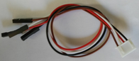 |
| 33   | JMP-1 17键 86*40*6.5MM                                      | 1        |  |
| 34   | USB线 AM/BM 透明蓝 OD:5.0 L=50cm                           | 1        | 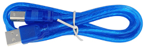 |
| 35   | 缠绕管 直径8MM 黑色                                        | 0.1      | 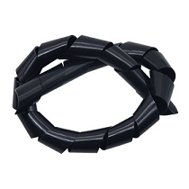 |
| 36   | 黑色 扎带 3*100MM                                          | 10       | 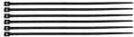 |

